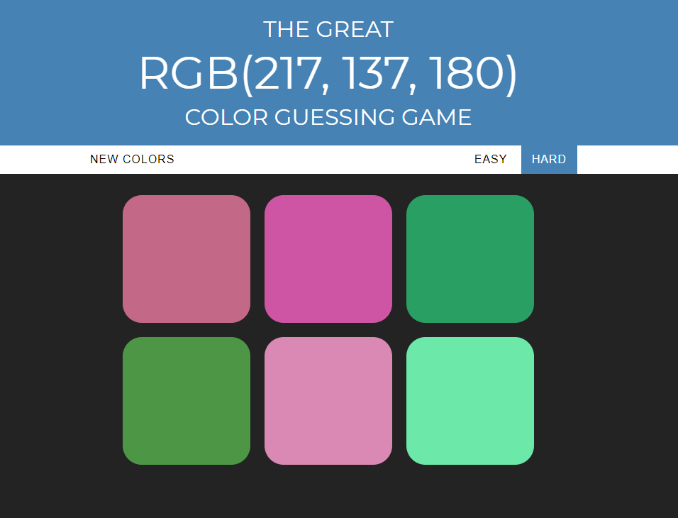

# Simple RGB color guessing game

Written in plain vanilla JavaScript

Coded this app when taking the course [The Web Developer Bootcamp](https://www.udemy.com/course/the-web-developer-bootcamp/) by [Colt Steele](https://www.udemy.com/user/coltsteele/)

Demo can be seen in here - https://saabbir.github.io/color-guessing-game/

## References

- [The Web Developer Bootcamp 2020](https://www.udemy.com/course/the-web-developer-bootcamp/)
